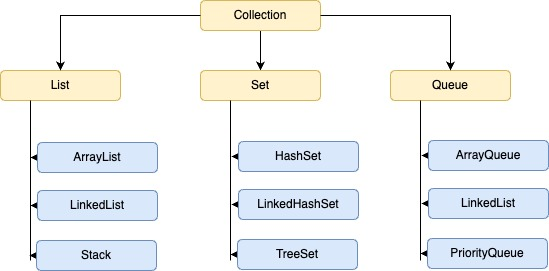
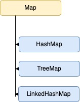

# Java Collections Framework Cheatsheet

#### 1. Overview

- **Collection Framework Architecture**
  - Collection Interface
  - Map Interface
  - Iterator Interface

#### 2. Collection Interface Hierarchy

- **Main Child Interfaces**

  - List
  - Set
  - Queue

    

#### 3. List Interface Implementations

##### 3.1 ArrayList

```java
ArrayList<Type> list = new ArrayList<>();

// Core Operations
list.add(element);              // Add element at end
list.add(index, element);       // Insert at index
list.get(index);               // Retrieve element
list.remove(index);            // Delete by index
list.set(index, element);      // Update element

// Utility Operations
list.addAll(collection);        // Bulk add
list.contains(element);        // Check existence
list.size();                   // Get length
list.clear();                  // Remove all
```

##### 3.2 Stack

```java
Stack<Type> stack = new Stack<>();

// Stack Operations
stack.push(element);           // Add to top
stack.pop();                   // Remove from top
stack.peek();                  // View top element
```

#### 4. Queue Interface Implementations

##### 4.1 LinkedList (Queue Usage)

```java
Queue<Type> queue = new LinkedList<>();

// Safe Operations
queue.offer(element);          // Add element
queue.poll();                  // Remove first
queue.peek();                  // View first

// Exception-throwing Operations
queue.add(element);            // Add (throws exception)
queue.remove();                // Remove (throws exception)
queue.element();               // View (throws exception)
```

##### 4.2 ArrayDeque

```java
ArrayDeque<Type> deque = new ArrayDeque<>();

// Double-ended Operations
deque.offerFirst(element);     // Add at front
deque.offerLast(element);      // Add at end
deque.pollFirst();             // Remove from front
deque.pollLast();              // Remove from end
deque.peekFirst();             // View front
deque.peekLast();              // View last
```

#### 5. Set Interface Implementations

##### 5.1 HashSet

```java
HashSet<Type> set = new HashSet<>();

// Basic Operations
set.add(element);              // Add element
set.remove(element);           // Remove element
set.contains(element);         // Check existence
set.size();                    // Get size
set.clear();                   // Remove all
```

##### 5.2 Specialized Sets

- **LinkedHashSet**
  - Maintains insertion order
  - Inherits HashSet methods
- **TreeSet**
  - Maintains natural ordering
  - O(log n) operations
  - Inherits HashSet methods

#### 6. Map Interface Implementations



##### 6.1 HashMap

```java
HashMap<KeyType, ValueType> map = new HashMap<>();

// Core Operations
map.put(key, value);           // Add/Update entry
map.get(key);                  // Retrieve value
map.remove(key);               // Remove entry

// Additional Operations
map.putIfAbsent(key, value);   // Conditional add
map.containsKey(key);          // Key check
map.containsValue(value);      // Value check

// Collection Views
map.keySet();                  // Get keys
map.values();                  // Get values
map.entrySet();               // Get entries
```

##### 6.2 TreeMap

- Maintains key-based sorting
- Same interface as HashMap
- O(log n) operations

#### 7. Utility Classes

##### 7.1 Arrays

```java
Arrays.sort(array);            // Sort array
Arrays.binarySearch(array, element);  // Search
Arrays.fill(array, value);     // Fill array
```

##### 7.2 Collections

```java
Collections.sort(list);        // Sort list
Collections.sort(list, comparator);   // Custom sort
Collections.min(collection);   // Find minimum
Collections.max(collection);   // Find maximum
Collections.frequency(collection, element);  // Count
```

#### 8. Best Practices

- Implement `Comparable` for natural ordering
- Use `Comparator` for custom ordering
- Override `equals()` and `hashCode()` for Hash-based collections
- Use lambda expressions for comparators:

```java
Collections.sort(list, (o1, o2) -> o1.name.compareTo(o2.name));
```
